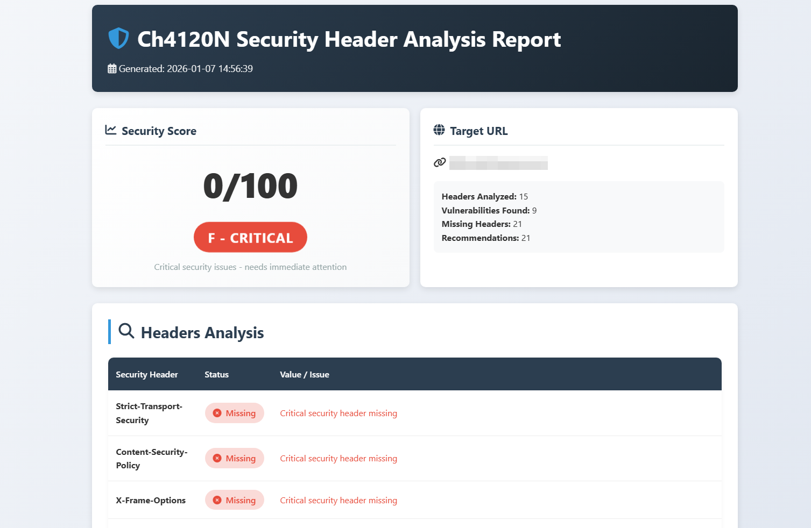
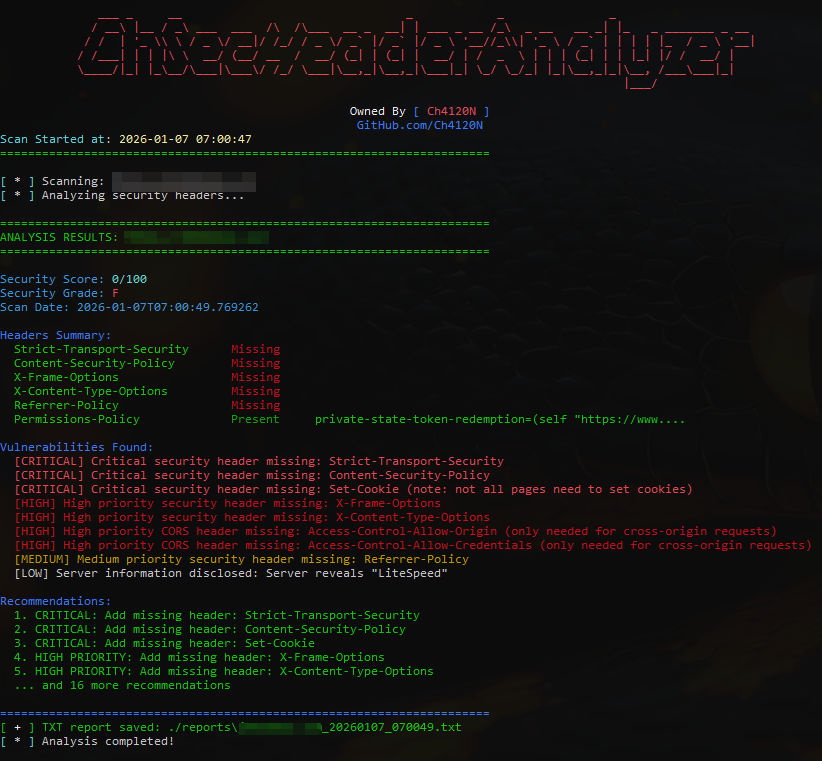

<head>
  <meta name="google-site-verification" content="l4gzIHopgDDt57xRYeRvJZ5DYgg4lLb-qPciUxhNxkY" />
</head>

<div align="center">

# **Ch4120N Security Header Analyzer**
### _**Comprehensive Security Header Analysis with Multi-Threaded Scanning**_


---

> **Ch4120N Security Header Analyzer** is a professional, cross-platform security tool for comprehensive HTTP header analysis, vulnerability detection, and security reporting with beautiful multi-format outputs.

</div>

---

## 👨‍💻 Project Programmer

> **Ch4120N** — [Ch4120N@Proton.me](mailto:Ch4120N@Proton.me)

---
## 🧠 Made For

> **Security professionals**, **penetration testers**, **system administrators**, and **web developers** who need to audit website security headers, identify vulnerabilities, and generate professional security reports for compliance and security assessments.

---

## 🖼️ Screenshots

<div align="center">

| HTML Report | Console Output |
| :---: | :---: |
|  |  |

</div>

---
## ✨ Features
### ⚡ Performance & Efficiency
- **Multi-threading**: Scan multiple websites simultaneously with configurable thread pools
- **Intelligent Rate Limiting**: Prevent server overload with controlled request rates
- **Connection Pooling**: Reusable HTTP connections for improved performance
- **Progress Tracking**: Real-time progress bars and ETA calculations
- **Batch Processing**: Analyze thousands of websites from file inputs

### 🎯 Comprehensive Security Analysis
- **51+ Vulnerability Checks**: Comprehensive detection of information disclosure headers
- **Cookie Security Analysis**: Detailed examination of Set-Cookie flags (Secure, HttpOnly, SameSite)
- **CORS Configuration Auditing**: Cross-Origin Resource Sharing security assessment
- **SSL/TLS Certificate Validation**: Automatic SSL certificate checks
- **Industry Compliance**: OWASP, CIS, PCI DSS, GDPR, ISO 27001 compliance reporting

### 📊 Professional Reporting
- **Multiple Formats**: HTML, JSON, CSV, TXT reports with beautiful templates
- **Priority-Based Recommendations**: Critical/High/Medium/Low priority categorization
- **Security Scoring**: Intelligent scoring system with letter grades (A-F)
- **Action Plans**: Timeline-based implementation recommendations
- **Combined Reports**: Aggregate analysis for multiple websites

### 🎨 User Experience
- **Beautiful Console UI**: Color-coded output with progress indicators
- **Interactive HTML Reports**: Clickable, animated reports with visual feedback
- **Cross-Platform Design**: Consistent experience on Windows, Linux, and macOS
- **Command-Line Flexibility**: Extensive options for customization
- **Verbose/Quiet Modes**: Adjustable output verbosity

### 🔧 Technical Excellence
- **Modular Architecture**: Clean, maintainable codebase with separation of concerns
- **Configuration Driven**: YAML-based configuration for easy customization
- **Error Handling**: Robust error recovery and logging
- **Dependency Management**: Clear requirements with version pinning
- **Professional Packaging**: Easy installation with setup.py

---

## 💻 Supported Platforms

- [x] **Windows** (10/11 with Python 3.7+)
- [x] **Linux** (All major distributions)
- [x] **macOS** (Catalina and newer)
- [x] **WSL** (Windows Subsystem for Linux)

---

## 🛠️ Installation
### Prerequisites
- **Python 3.7 or higher**
- **pip** (Python package manager)
- **Git** (for cloning the repository)

### Installation Methods

#### **Method 1: From Source (Recommended)**
```bash
# Clone the repository
git clone https://github.com/Ch4120N/ChSecurityHeaderAnalyzer.git
cd ChSecurityHeaderAnalyzer

# Install dependencies
pip install -r requirements.txt
```

#### **Method 2: Direct Script Usage**
```bash
# Just download and run
git clone https://github.com/Ch4120N/ChSecurityHeaderAnalyzer.git
cd ChSecurityHeaderAnalyzer
python chSecurityHeaderAnalyzer.py -u https://example.com
```

## 🚀 Quick Start Guide
### **Basic Usage Examples**
```bash
# Analyze a single website
python chSecurityHeaderAnalyzer.py -u https://example.com

# Analyze with all output formats
python chSecurityHeaderAnalyzer -u https://example.com -o all

# Analyze multiple websites from file (20 threads)
python chSecurityHeaderAnalyzer -f urls.txt -t 20 -o html csv

# Analyze comma-separated URLs
python chSecurityHeaderAnalyzer --bulk -u "https://site1.com,https://site2.com"

# Generate HTML report only
python chSecurityHeaderAnalyzer -u https://target.com -o html --output-dir ./security_reports
```

### **Advanced Usage Examples**
```bash
# Custom timeout and disable SSL verification
python chSecurityHeaderAnalyzer -u https://internal-site.com --timeout 30 --no-verify

# Quiet mode for scripting (JSON output only)
python chSecurityHeaderAnalyzer -u https://example.com -q -o json

# Verbose mode for debugging
python chSecurityHeaderAnalyzer -u https://example.com -v

# Custom user agent and no redirects
python chSecurityHeaderAnalyzer -u https://example.com --user-agent "MySecurityScanner/1.0" --no-redirect

# Bulk analysis with custom configuration
python chSecurityHeaderAnalyzer -f websites.txt -t 15 --output-dir ./audit_reports --no-color
```

### **Command Line Reference**
```bash
usage: chSecurityHeaderAnalyzer.py [-h] (-u URL | -f FILE | --bulk)
                                   [-o {txt,json,csv,html,all} [{txt,json,csv,html,all} ...]]
                                   [--output-dir OUTPUT_DIR] [--no-report] [-t THREADS] [--timeout TIMEOUT]
                                   [--no-verify] [--no-redirect] [--user-agent USER_AGENT] [-v] [-q] [--no-color]
                                   [--version]

ChSecurityHeaderAnalyzer - Comprehensive Security Header Analysis Tool
Owned By: @Ch4120N
GitHub Repo: https://github.com/Ch4120N/ChSecurityHeaderAnalyzer

optional arguments:
  -h, --help            show this help message and exit
  -u URL, --url URL     Single URL to analyze
  -f FILE, --file FILE  File containing URLs (one per line)
  --bulk                Treat URL argument as comma-separated list
  -o {txt,json,csv,html,all} [{txt,json,csv,html,all} ...], --output {txt,json,csv,html,all} [{txt,json,csv,html,all} ...]
                        Output format(s)
  --output-dir OUTPUT_DIR
                        Custom output directory
  --no-report           Don't save reports, only display results
  -t THREADS, --threads THREADS
                        Number of threads for bulk scan
  --timeout TIMEOUT     Request timeout in seconds
  --no-verify           Disable SSL certificate verification
  --no-redirect         Disable following redirects
  --user-agent USER_AGENT
                        Custom User-Agent string
  -v, --verbose         Verbose output
  -q, --quiet           Quiet mode (minimal output)
  --no-color            Disable colored output
  --version             show program's version number and exit

Examples:
  chSecurityHeaderAnalyzer.py https://example.com
  chSecurityHeaderAnalyzer.py -u https://example.com -o json csv
  chSecurityHeaderAnalyzer.py -f urls.txt -t 20 -o all
  chSecurityHeaderAnalyzer.py -u https://example.com --no-verify --timeout 30
  chSecurityHeaderAnalyzer.py -b -f urls.txt -o html --output-dir ./reports
```

## 📊 Security Headers Analyzed
### **🔴 Critical Security Headers (Required)**
- `Strict-Transport-Security` (HSTS)
- `Content-Security-Policy` (CSP)
- `X-Frame-Options`
- `X-Content-Type-Options`
- `Referrer-Policy`
- `Permissions-Policy`
- `Set-Cookie` (Security Flags)
- `Access-Control-Allow-Origin`
- `Access-Control-Allow-Credentials`

### **🟡 Recommended Headers**
- `Cache-Control`
- `Clear-Site-Data`
- `Cross-Origin-Embedder-Policy`
- `Cross-Origin-Opener-Policy`
- `Cross-Origin-Resource-Policy`
- `X-Permitted-Cross-Domain-Policies`
- `X-Download-Options`
- `Content-Type`
- `X-DNS-Prefetch-Control`
- `Expect-CT`
- `Feature-Policy`
- `Public-Key-Pins`
- `X-Robots-Tag`
- `X-Request-ID`

### ⚠️ Vulnerable Headers (51+ Detected)
- `Server` (Version Disclosure)
- `X-Powered-By` (Technology Stack)
- `X-AspNet-Version` (ASP.NET Version)
- `X-AspNetMvc-Version` (ASP.NET MVC)
- `X-Runtime` (Application Runtime)
- `X-Version` (Application Version)
- `X-Generator` (CMS/Framework)
- `X-Drupal-Cache` (Drupal Detection)
- `X-Pingback` (WordPress Feature)
- `X-Backend-Server` (Infrastructure)
- `X-Served-By` (Load Balancer Info)
- `X-Host` (Host Information)
- `X-Backend` (Backend Systems)
- `X-Server` (Server Identification)
- `X-Engine` (Engine/Platform)
- `X-PHP-Version` (PHP Version)
- `X-PHP-Platform` (PHP Platform)
- `X-Request-Id` (Request Tracking)
- `X-Cache-Info` (Cache Status)
- `X-Cache-Hits` (Cache Performance)
- `Via` (Proxy Information)
- `X-Varnish` (Varnish Cache)
- `X-Amz-Cf-Id` (CloudFront)
- `X-Amz-Cf-Pop` (CloudFront PoP)
- `CF-Ray` (Cloudflare)
- `CF-Cache-Status` (Cloudflare Cache)
- `X-Google-Cache-Control` (Google Cache)
- `X-Source-Scheme` (Source Scheme)
- `X-Forwarded-Server` (Proxy Forwarding)
- `X-Forwarded-Host` (Original Host)
- `X-Forwarded-Proto` (Original Protocol)
- `X-Original-URL` (Original URL)
- `X-Rewrite-URL` (Rewritten URL)
- `X-Content-Type` (Content Type)
- `X-UA-Compatible` (IE Compatibility)
- `X-Wap-Profile` (Mobile Profile)
- `X-ATT-DeviceId` (AT&T Device)
- `X-Content-Duration` (Content Duration)
- `X-Content-Security-Policy` (Legacy CSP)
- `X-WebKit-CSP` (WebKit CSP)
- `X-Content-Security-Policy-Report-Only`
- `X-Firefox-Security-Policy`
- `X-XSS-Protection` (Deprecated XSS Protection)

## 📈 Security Scoring System
### **Grade Scale (A-F)**
- **A (90-100)**: Excellent security posture
- **B (75-89)**: Good security, minor improvements needed
- **C (60-74)**: Fair security, several improvements needed
- **D (40-59)**: Poor security, significant improvements required
- **F (0-39)**: Critical security issues

### **Scoring Components**
- **Required Headers Present** (+3 points each, max +30)
- **Recommended Headers Present** (+2 points each, max +20)
- **Missing Critical Headers** (-8 points each)
- **Missing High Priority Headers** (-5 points each)
- **Missing Medium Priority Headers** (-3 points each)
- **Critical Vulnerabilities** (-12 points each)
- **High Vulnerabilities** (-8 points each)
- **Medium Vulnerabilities** (-4 points each)
- **Low Vulnerabilities** (-2 points each)
- **Vulnerable Headers Found** (-1 point each, max -15)
- **Special Bonuses** (Strong configurations: +10 points)

## 🏗️ Project Structure
```text
ChSecurityHeaderAnalyzer/
├── chSecurityHeaderAnalyzer.py      # Main entry point
├── modules/                         # Core modules
│   ├── __init__.py                  # Package initialization
│   ├── scanner.py                   # HTTP scanning with multi-threading
│   ├── analyzer.py                  # Header analysis and vulnerability detection
│   ├── reporter.py                  # Multi-format report generation
│   ├── ui.py                        # Beautiful console interface
│   └── utils.py                     # Utility functions and configuration
├── config/
│   └── config.yaml                  # Comprehensive configuration
├── .gitignore                       # git ignore configuration
├── requirements.txt                 # Python dependencies
├── LICENSE                          # GPLv3 License
└── README.md                        # This documentation
```

### **Core Modules Breakdown**
2. **Scanner Module** (`scanner.py`)
- Multi-threaded HTTP requests
- Connection pooling and retry logic
- Rate limiting and timeout management
- SSL/TLS configuration

3. **Analyzer Module** (`analyzer.py`)
- Comprehensive header analysis
- Vulnerability detection engine
- Security scoring algorithm
- Priority-based recommendations

4. **Reporter Module** (`reporter.py`)
- HTML report generation with beautiful templates
- CSV export with detailed sections
- JSON output for machine processing
- TXT reports for quick reviews
- UI Module (ui.py)
- Color-coded console output
- Progress bars and tracking
- Interactive display elements
- Cross-platform color support

5. **Utilities Module** (`utils.py`)
- Configuration management
- Logging setup
- URL validation
- File operations

## 🔧 Configuration
### **Configuration File** (`config/config.yaml`)
```yaml
# Security Headers Configuration
security_headers:
  required:
    - Strict-Transport-Security
    - Content-Security-Policy
    - X-Frame-Options
    - X-Content-Type-Options
    - Referrer-Policy
    - Permissions-Policy
    - Set-Cookie
    - Access-Control-Allow-Origin
    - Access-Control-Allow-Credentials
  
  recommended:
    - Cache-Control
    - Clear-Site-Data
    - Cross-Origin-Embedder-Policy
    - Cross-Origin-Opener-Policy
    - Cross-Origin-Resource-Policy
    - X-Permitted-Cross-Domain-Policies
    - X-Download-Options
    - Content-Type
    - X-DNS-Prefetch-Control
    - Expect-CT
    - Feature-Policy
    - Public-Key-Pins
    - X-Robots-Tag
    - X-Request-ID
  
  vulnerable_headers:
    - Server
    - X-Powered-By
    - X-AspNet-Version
    - X-AspNetMvc-Version
    - X-Runtime
    - X-Version
    - X-Generator
    - X-Drupal-Cache
    - X-Pingback
    - X-Backend-Server
    - X-Served-By
    - X-Host
    - X-Backend
    - X-Server
    - X-Engine
    - X-PHP-Version
    - X-PHP-Platform
    - X-Request-Id
    - X-Cache-Info
    - X-Cache-Hits
    - Via
    - X-Varnish
    - X-Amz-Cf-Id
    - X-Amz-Cf-Pop
    - CF-Ray
    - CF-Cache-Status
    - X-Google-Cache-Control
    - X-Source-Scheme
    - X-Forwarded-Server
    - X-Forwarded-Host
    - X-Forwarded-Proto
    - X-Original-URL
    - X-Rewrite-URL
    - X-Content-Type
    - X-UA-Compatible
    - X-Wap-Profile
    - X-ATT-DeviceId
    - X-Content-Duration
    - X-Content-Security-Policy
    - X-WebKit-CSP
    - X-Content-Security-Policy-Report-Only
    - X-Firefox-Security-Policy
    - X-XSS-Protection

# Scanner Configuration
scanner:
  timeout: 10
  max_redirects: 5
  user_agent: "ChSecurityHeaderAnalyzer/1.0"
  verify_ssl: true
  follow_redirects: true
  thread_count: 10
  rate_limit: 10  # requests per second

# Reporting Configuration
reporting:
  default_output_dir: "./reports"
  formats:
    - txt
    - json
    - csv
    - html
  include_timestamp: true
  compress_reports: false

# Vulnerabilities Configuration
vulnerabilities:
  missing_headers:
    critical: 
      - Strict-Transport-Security
      - Content-Security-Policy
      - Set-Cookie
    high: 
      - X-Frame-Options
      - X-Content-Type-Options
      - Access-Control-Allow-Origin
      - Access-Control-Allow-Credentials
    medium: 
      - Referrer-Policy
      - Permissions-Policy
  
  weak_configurations:
    hsts:
      max_age_minimum: 31536000
      include_subdomains: true
      preload: true
    
    csp:
      unsafe_inline: false
      unsafe_eval: false
      https_required: true
    
    cookie:
      secure_required: true
      httponly_required: true
      samesite_required: "Strict"
    
    cors:
      wildcard_allowed: false
      credentials_with_wildcard: false
      methods_exposed: ["GET", "POST", "HEAD", "OPTIONS"]
    
    cache:
      no_store_required: true
      no_cache_required: false
      private_required: true
      must_revalidate_required: true

# Grading Configuration
grading:
  score_weights:
    required_header: 10
    recommended_header: 5
    vulnerable_header_found: -15
    weak_configuration: -5
  
  grade_thresholds:
    A: 80
    B: 65
    C: 50
    D: 35
    F: 0

# Additional Checks Configuration
additional_checks:
  check_cookie_flags: true
  check_csp_directives: true
  check_cors_configuration: true
  check_hsts_preload_status: false
  check_ssl_certificate: true
  check_tls_version: true
  check_http_methods: true
  check_server_banner: true
```

### **Custom Configuration Locations**
The tool searches for configuration in this order:
1. `./config/config.yaml` (Project directory)
2. `/etc/chSecurityHeaderAnalyzer/config.yaml` (System-wide)
3. `~/.chSecurityHeaderAnalyzer/config.yaml` (User directory)
4. Default configuration (built-in)

## 📋 Report Formats
### **HTML Reports**
- **Beautiful, responsive design** with gradients and animations
- **Interactive elements** with hover effects
- **Color-coded severity indicators**
- **Priority-based recommendations**
- **Improvement summary** with potential scores
- **Mobile-friendly** responsive layout

### **CSV Reports**
- **14 Comprehensive Sections**:
    1. Executive Summary
    2. Security Score Breakdown
    3. Headers Analysis
    4. Vulnerabilities Detailed
    5. Prioritized Recommendations
    6. Improvement Summary
    7. Risk Assessment Matrix
    8. Compliance Status
    9. Technical Details
    10. Cookie Security Analysis
    11. CORS Configuration Analysis
    12. Additional Security Checks
    13. Action Plan
    14. Scan Metadata

### **JSON Reports**
- **Machine-readable** structured data
- **Complete analysis** including raw headers
- **Categorized recommendations** by priority
- **Implementation estimates** with timelines
- **Score breakdown** for detailed analysis

### **TXT Reports**
- **Clean, readable format** for quick reviews
- **ASCII-based formatting** with clear sections
- **Priority-based recommendations**
- **Implementation summaries**
- **Command-line friendly output**

## 🔍 Technical Implementation Details
### **Connection Management**
- **Session reuse** with connection pooling
- **Retry logic** with exponential backoff
- **Rate limiting** to prevent server overload
- **SSL verification** with configurable options
- **Timeout handling** with graceful failure
### **Security Analysis Engine**
- **Pattern matching** for vulnerable headers
- **Cookie flag analysis** (Secure, HttpOnly, SameSite)
- **CORS policy evaluation** for security misconfigurations
- **SSL certificate validation** with error reporting
- **Server banner analysis** for information disclosure

## 🛡️ Security Considerations
### **Safe Usage Guidelines**
1. **Rate Limiting**: Default 10 requests/sec to avoid overwhelming servers
2. **Respect robots.txt**: Consider checking robots.txt before scanning
3. **Legal Complianc**: Only scan websites you own or have permission to test
4. **Disclosure**: Report findings responsibly to website owners
5. **Data Protection**: Generated reports may contain sensitive information
### **Ethical Usage**
- Use for authorized security assessments only
- Respect privacy and data protection laws (GDPR, CCPA, etc.)
- Obtain written permission before scanning third-party sites
- Use --no-verify only for internal/development environments
- Consider off-peak hours for large-scale scans

### Responsible Disclosure
If you discover critical vulnerabilities:

- **Document evidence** with screenshots and reports
- **Contact website owner** through official channels
- **Provide clear remediation steps**
- **Allow reasonable time** for fixes before disclosure
- **Never exploit vulnerabilities** for unauthorized access

## 🆘 Troubleshooting Guide
### **Common Issues and Solutions**


| Issue | Solution |
|-------|----------|
| **Connection Errors** | Increase timeout with `--timeout 30`, check network connectivity |
| **SSL Certificate Errors** | Use `--no-verify` for internal sites (not recommended for production) |
| **No Output/Freezing** | Check thread count with `-t 5`, reduce if system is overloaded |
| **Memory Issues** | Reduce thread count, use `-t 5` for memory-constrained systems |
| **Report Generation Errors** | Ensure write permissions in output directory |
| **Color Display Issues** | Use `--no-color` for terminals without ANSI support |
| **Slow Performance** | Check network speed, reduce thread count, increase timeout| 
| **Invalid URLs** | Use `-v` flag to see which URLs are being skipped |

### **Dependency Issues**
```bash
# Reinstall dependencies
pip uninstall -r requirements.txt -y
pip install -r requirements.txt

# Check Python version
python --version  # Should be 3.7+

# Verify installation
python -c "import requests; import pandas; import yaml; print('All imports successful')"
```

## 🤝 Contributing
We welcome contributions! Here's how to get started:
### **Development Setup**
```bash
# Fork and clone the repository
git clone https://github.com/Ch4120N/ChSecurityHeaderAnalyzer.git
cd ChSecurityHeaderAnalyzer

# Create virtual environment
python -m venv venv
source venv/bin/activate  # On Windows: venv\Scripts\activate

# Install development dependencies
pip install -r requirements.txt
```

### **Contribution Guidelines**

1. **Fork** the repository
2. **Create a feature branch**: `git checkout -b feature/amazing-feature`
3. **Make your changes** following existing code style
4. **Add tests** for new functionality
5. **Update documentation** as needed
6. **Commit changes**: `git commit -m 'Add amazing feature'`
7. **Push to branch**: `git push origin feature/amazing-feature`
8. **Open a Pull Request**

### **Code Style**
- Follow PEP 8 guidelines
- Use type hints for function signatures
- Add docstrings for all public functions
- Keep functions focused and small
- Write modular, testable code

## 🏆 Real-World Use Cases
### **Enterprise Security Audits**
```bash
# Scan entire organization websites
python chSecurityHeaderAnalyzer.py -f enterprise_sites.txt -t 20 -o html csv \
  --output-dir ./security_audit_q1_2024

# Generate compliance reports
python chSecurityHeaderAnalyzer.py -f pci_compliant_sites.txt -o html \
  --output-dir ./pci_audit_reports
```

### **Web Development**
```bash
# Test staging environment
python chSecurityHeaderAnalyzer.py -u https://staging.example.com -o html

# Monitor security headers in CI/CD pipeline
python chSecurityHeaderAnalyzer.py -u https://${DEPLOYMENT_URL} -o json | \
  jq '.security_score' | \
  if [ $(cat) -lt 80 ]; then echo "Security score too low!"; exit 1; fi
```

### **Penetration Testing**
```bash
# Classroom demonstrations
python chSecurityHeaderAnalyzer.py -u https://vulnerable.demo -o html \
  --output-dir ./class_demo

# Security workshop exercises
python chSecurityHeaderAnalyzer.py -f student_sites.txt -t 5 -o txt \
  --output-dir ./workshop_results
```

## ❤️ Support the Project
If you find this tool valuable for your security work, consider supporting its development:

### **One-time Donation**
| Cryptocurrency | Address |
|----------------|---------|
| **Bitcoin (BTC)** | `bc1ql4syps7qpa3djqrxwht3g66tldyh4j7qsyjkq0` |
| **Ethereum (ETH)** | `0xfddbd535a4ad28792cbebceee3d6982d774e6d13` |
| **USDT (TRC20)** | `3Cq6HRQsiwZFmPEQfG9eJkZE2QGChvf2VN` | 

### **Support Options**
- **Star the repository** on GitHub
- **Share with colleagues** who might benefit
- **Report issues** and suggest improvements
- **Contribute code** or documentation

> Your support helps maintain and improve the tool for everyone!

## 🙏 Acknowledgments
- **OWASP Community** for security guidance and best practices
- **Python Community** for excellent libraries and tools
- **Security Researchers** worldwide who share their knowledge
- **Open Source Projects** that inspired this tool:
    - [securityheaders.com](https://securityheaders.com/)
    - [Mozilla Observatory](https://observatory.mozilla.org/)
    - [Nikto](https://github.com/sullo/nikto)
    - [Nuclei](https://github.com/projectdiscovery/nuclei)

### **Special Thanks**
To all the security professionals, penetration testers, and system administrators who test websites and make the internet safer for everyone.

<div align="center">

"Security is not a product, but a process. This tool helps you audit that process."

**⭐ If this tool helps secure your websites, give it a star on GitHub!**


**Stay Secure. Stay Vigilant.**

**Made with** ❤️ by Ch4120N

</div>